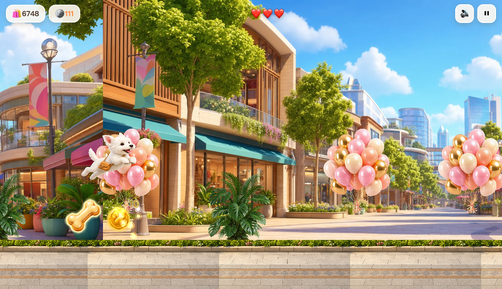

# 西高地勇闯万象城 🐕🛍️

一只勇敢的西高地白梗，在「万象天地」露天现代街区一路狂奔、跳跃、收集商品的横版跑酷小游戏。皮克斯 3D 风格美术，WebGL 特效，手机/电脑全平台全屏自适应，点开即玩。

> 🎮 **在线试玩**：https://wxshunbang-ui.github.io/westie-mixc-run/



## 玩法

- **跳跃**：点屏幕 / 按空格 / 鼠标左键
- **二段跳**：起跳后再点一次，可跳更高（够到高处商品）
- **可变跳跃**：长按跳得更高，短按跳得低
- 🦴 收集商品加分，连续收集触发 **连击倍数**（最高 x5）
- 🪙 收集金币攒积分
- 🛒 撞到购物车 / 警示牌 / 礼盒会掉一颗 ❤️，三颗掉光即结束
- 跑得越远越快，挑战最高分并分享给朋友

## 技术特性

- **引擎**：[Phaser 3.90](https://phaser.io)（WebGL 渲染 + FX 辉光 + 粒子）
- **美术**：全部由 `gpt-image-2` 生成皮克斯 3D 风格，绿幕抠像转**带透明通道的 WebP**（总资源仅 ~2.3MB）
- **音效**：WebAudio 实时合成，零外部音频文件
- **全屏自适应**：`Scale.RESIZE` + `100dvh` + 灵动岛安全区 `env(safe-area-inset-*)`，电脑/安卓/iPhone 全平台铺满
- **PWA**：可「添加到主屏幕」在 iPhone 以独立窗口真全屏运行；Service Worker 缓存，**离线可玩**
- **跨设备公平计分**：得分按归一化速度计算，与屏幕尺寸无关，方便和朋友比分

## 本地运行

```bash
# 任意静态服务器即可
python3 -m http.server 8124
# 浏览器打开 http://localhost:8124
```

> 调试模式：URL 加 `?debug=1` 会把当前场景挂到 `window.__scene`，方便控制台调试。

## 重新生成美术资源

```bash
bash gen.sh list                       # 查看所有资源名
printf '%s\n' <name> | xargs -P4 -I{} bash gen.sh {}   # 生成
python3 keyout.py                      # 绿幕抠像 + 转 WebP + 生成图标
```
（需要本地 `gpt-image-server` 运行在 `127.0.0.1:19080`。）

## 目录结构

```
index.html              # 入口 + 各界面 DOM + PWA meta
css/style.css           # 全屏自适应 / 安全区 / 视觉样式
js/audio.js             # WebAudio 音效合成
js/game.js              # Phaser 游戏核心（物理/关卡/特效/碰撞）
js/main.js              # DOM 界面控制 + 事件桥接 + 分享/全屏/PWA
lib/phaser.min.js       # 引擎（本地化，离线可用）
assets/*.webp           # 游戏美术（透明精灵 + 背景）
manifest.webmanifest    # PWA 清单
sw.js                   # Service Worker（离线缓存）
gen.sh / keyout.py      # 美术资源生成 & 后处理流水线
```

---

美术由 gpt-image-2 生成 · 引擎 Phaser 3 · 用 ❤️ 和 🐾 制作
